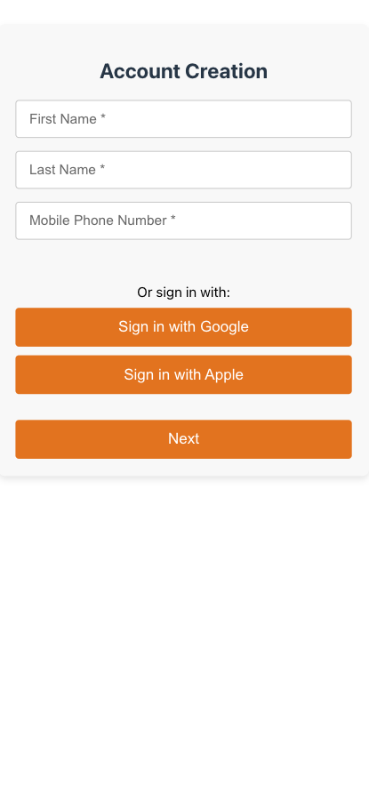
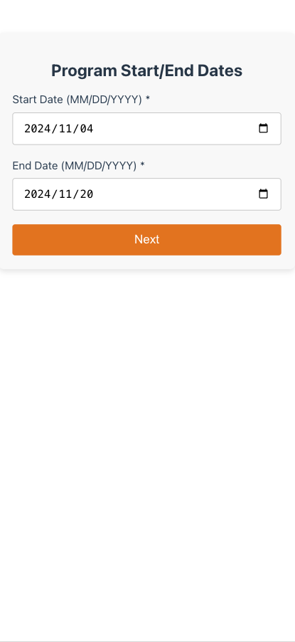
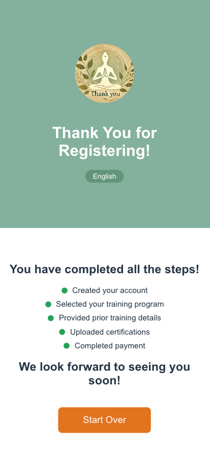

# 🧘 Yoga Instructor Registration Application

Welcome to the Yoga Instructor Registration web application! This project was developed as part of the CS601 coursework.

	•	👤 Author: Yujun Liu
	•	🏫 Class: CS601
	•	📅 Date: 10/25/2024

## Preview







## 📖 Table of Contents

	•	Project Overview
	•	Features
	•	Technologies Used
	•	Installation and Setup
	•	Running the Application
	•	Skipping Payment
	•	Project Structure
	•	Component Overview
	•	Important Notes
	•	Contact Information

## 🌟 Project Overview

The Yoga Instructor Registration application streamlines the process for individuals to register for yoga training programs. Users can:

	•	Create an account
	•	Select a training program level
	•	Provide prior training details
	•	Upload certifications
	•	Complete payment securely through Stripe

## ✨ Features

	•	📝 User Registration: Collect personal details to create an account.
	•	🎯 Program Selection: Choose from Beginner, Intermediate, or Advanced/Expert levels.
	•	📆 Program Dates: Input start and end dates for the selected program.
	•	📚 Prior Training Details: Provide information about previous yoga training.
	•	📄 Certificate Upload: Upload certification(s) as proof of prior training.
	•	💳 Payment Processing: Secure payment integration using Stripe’s Payment Element.
	•	📱 Responsive Design: Optimized for various devices and screen sizes.

## 🛠️ Technologies Used

Frontend:

	•	⚛️ React.js
	•	🧭 React Router
	•	🎨 CSS3

Backend:

	•	🖥️ Node.js
	•	🚂 Express.js

Payment Processing:

	•	💰 Stripe API

Additional Libraries:

	•	📦 @stripe/stripe-js
	•	📦 @stripe/react-stripe-js
	•	🔄 Cors

## 📝 Installation and Setup

📋 Prerequisites

	•	Node.js (version 14 or newer)
	•	npm (Node Package Manager)

## 📥 Clone the Repository

git clone https://github.com/AJun01/registar.git
cd /registar

## 📦 Install Dependencies

npm install

## 🚀 Running the Application

🔧 Start the Backend Server

Before starting the frontend application, ensure the backend server is running.

	1.	Navigate to the project directory (if not already there):

cd /registar


	2.	Start the server:

node src/server/server.js

Make sure the server starts successfully and is listening on port 4242:

Node server listening on port 4242!


## 🌐 Start the Frontend Application

Open a new terminal window in the same project directory:

npm start

This should automatically open the application in your default web browser at http://localhost:3000.

⏭️ Skipping Payment

If you wish to skip the payment process during testing or development, you can navigate directly to the goodbye screen by adding /goodbye to the URL in your browser:

http://localhost:3000/goodbye

## 🗂️ Project Structure

```
hw5-yoga/yoga-registar
├── node_modules/
├── public/
│   ├── favicon.ico
│   └── index.html
├── src/
│   ├── images/
│   │   ├── advanced.jpg
│   │   ├── beginner.jpg
│   │   ├── default-profile.jpg
│   │   ├── intermediate.jpg
│   │   ├── yoga-icon.png
│   │   └── yoga-thank-you.png
│   ├── server/
│   │   └── server.js
│   ├── uploads/
│   ├── views/
│   │   ├── goodbye/
│   │   │   ├── GoodbyeScreen.css
│   │   │   └── GoodbyeScreen.js
│   │   ├── intake/
│   │   │   ├── IntakeForm.css
│   │   │   └── IntakeForm.js
│   │   ├── payment/
│   │   │   ├── Payment.css
│   │   │   └── Payment.js
│   │   ├── programDates/
│   │   │   ├── ProgramDates.css
│   │   │   └── ProgramDates.js
│   │   ├── trainingProgramSelection/
│   │   │   ├── TrainingProgramSelection.css
│   │   │   └── TrainingProgramSelection.js
│   │   ├── upload/
│   │   │   ├── UploadCertificate.css
│   │   │   └── UploadCertificate.js
│   │   └── welcome/
│   │       ├── WelcomeScreen.css
│   │       └── WelcomeScreen.js
├── App.css
├── App.js
├── index.css
├── index.js
├── .gitignore
├── package-lock.json
├── package.json
└── README.md
```

## 🧩 Component Overview

Frontend Components (Located in src/views/)

	•	👋 welcome/WelcomeScreen.js & WelcomeScreen.css:
	•	Displays the welcome screen with options to start the registration process.
	•	📝 intake/IntakeForm.js & IntakeForm.css:
	•	Collects the user’s personal information for account creation.
	•	🎯 trainingProgramSelection/TrainingProgramSelection.js & TrainingProgramSelection.css:
	•	Allows users to select their desired training program level, with descriptions and images.
	•	📆 programDates/ProgramDates.js & ProgramDates.css:
	•	Users input the start and end dates for their selected program.
	•	📄 upload/UploadCertificate.js & UploadCertificate.css:
	•	Enables users to upload their certification(s) as proof of prior training.
	•	💳 payment/Payment.js & Payment.css:
	•	Integrates Stripe’s Payment Element for secure payment processing.
	•	🎉 goodbye/GoodbyeScreen.js & GoodbyeScreen.css:
	•	Displays a thank-you message upon successful registration completion.

Backend

	•	🖥️ server/server.js:
	•	Handles backend operations, including creating PaymentIntents with Stripe and configuring CORS.

Images (Located in src/images/)

	•	🖼️ Program Images:
	•	beginner.jpg, intermediate.jpg, advanced.jpg: Images representing each program level.
	•	🎨 Other Images:
	•	default-profile.jpg, yoga-icon.png, yoga-thank-you.png: Used throughout the application for branding and UI elements.

⚠️ Important Notes

	•	🔑 API Keys: Replace placeholder API keys with your actual Stripe test keys in both the frontend and backend code. Never expose your secret key in client-side code or commit it to a public repository.
	•	Frontend (Payment.js):

const stripePromise = loadStripe('your_test_publishable_key'); // pk_test_...


	•	Backend (server.js):

const stripe = require('stripe')('your_test_secret_key'); // sk_test_...


	•	🔄 CORS Configuration: The backend server uses CORS to allow requests from http://localhost:3000. Ensure that the CORS middleware is properly configured:

const cors = require('cors');
app.use(cors({ origin: 'http://localhost:3000' }));


	•	🚦 Running the Backend Server: Always start the backend server before running the frontend application to ensure the payment functionality works correctly.

node src/server/server.js


	•	💳 Testing Payments: Use Stripe’s test card numbers to simulate payments:
	•	Card Number: 4242 4242 4242 4242
	•	Expiry Date: Any future date (e.g., 12/34)
	•	CVC: Any 3-digit number (e.g., 123)
	•	📁 Uploads Directory: The src/uploads/ directory is intended for storing uploaded certificates. Ensure this directory exists and is writable.

📞 Contact Information

For any questions or suggestions, please contact:

	•	👤 Author: Yujun Liu
	•	📧 Email: yujunliu@example.com

This project was developed as part of the CS601 course, submitted on 10/25/2024.